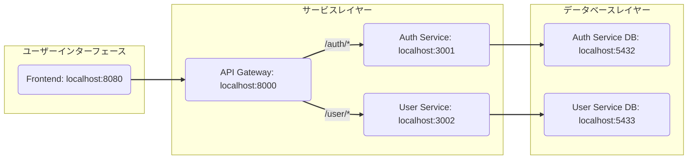

# アーキテクチャ構成図



# バックエンド起動
```
$ make up
```
## Swagger UI
- [Auth Service](http://localhost:3001/api-docs/)
- [User Service](http://localhost:3002/api-docs/)

# フロントエンド起動
```
$ cd frontend
$ npm run serve
```
http://localhost:8080/


# マイグレーション
```
$ docker compose exec [service] npx prisma migrate dev
$ docker compose exec [service] npx prisma generate
```