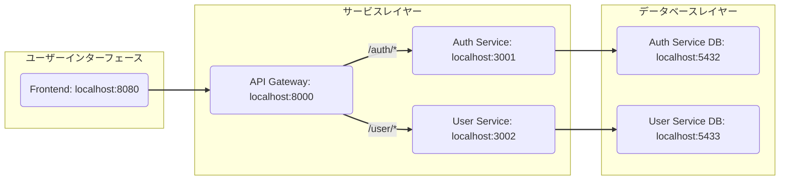

# アーキテクチャ構成図

</br>

# サービス間の連携
### 概要
Kafka を使用して、auth-service（認証サービス）とuser-service（ユーザー管理サービス）間のデータ連携を非同期に行っています。

### 使用構成
| コンポーネント | 内容 |
| -- | --|
| Kafka Broker | メッセージの中心ハブ |
| Zookeeper | Kafkaのメタ情報管理 |
| Kafka UI | Webベースの監視ツール（http://localhost:8081） |

</br>
</br>


# バックエンド起動
```
$ make up
```
## Swagger UI
- [Auth Service](http://localhost:3001/api-docs/)
- [User Service](http://localhost:3002/api-docs/)

# フロントエンド起動
```
$ cd frontend
$ npm run serve
```
http://localhost:8080/


# マイグレーション
```
$ docker compose exec [service] npx prisma migrate dev
$ docker compose exec [service] npx prisma generate
```