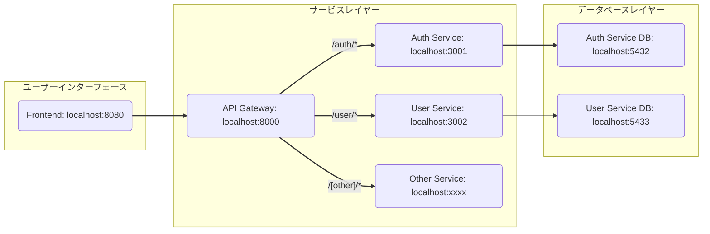

# 概要
このプロジェクトは、マイクロサービスアーキテクチャで構築されたプロジェクトです。認証・ユーザー管理・OCR処理の各機能が独立したサービスとして動作し、API Gatewayを介して統合されています。

| サービス | 技術スタック | ポート |
| -- | -- | -- |
| Frontend | Vue + VueRouter + Vuetify + SockJS | 8080 |
| API Gateway | Node.js + Express + http-proxy-middleware | 8000 |
| Auth Service | Node.js + Express + JWT + kafka| 3001 |
| User Service | Node.js + Express + kafka | 3002 |
| OCR Service |Flask + Pillow + PyTesseract |3003 |
| Memo Service |Spring Boot + Spring WebSocket | 3004 |

* [Frontendの概要](./frontend/README.md)
* [API Gatewayの概要](./services/api-gateway/README.md)
* [Auth Serviceの概要](./services/auth-service/README.md)
* [User Serviceの概要](./services/user-service/README.md)
* [OCR Serviceの概要](./services/ocr-service/README.md)
* [MEMO Serviceの概要](./services/memo-service/README.md)

# アーキテクチャ構成図

 

# サービス間の連携
Kafka を使用して、auth-service（認証サービス）とuser-service（ユーザー管理サービス）間のデータ連携を非同期に行っています。

### 使用構成
| コンポーネント | 内容 |
| -- | --|
| Kafka Broker | メッセージの中心ハブ |
| Zookeeper | Kafkaのメタ情報管理 |
| Kafka UI | Webベースの監視ツール ([http://localhost:8081](http://localhost:8081)) |

 
 
