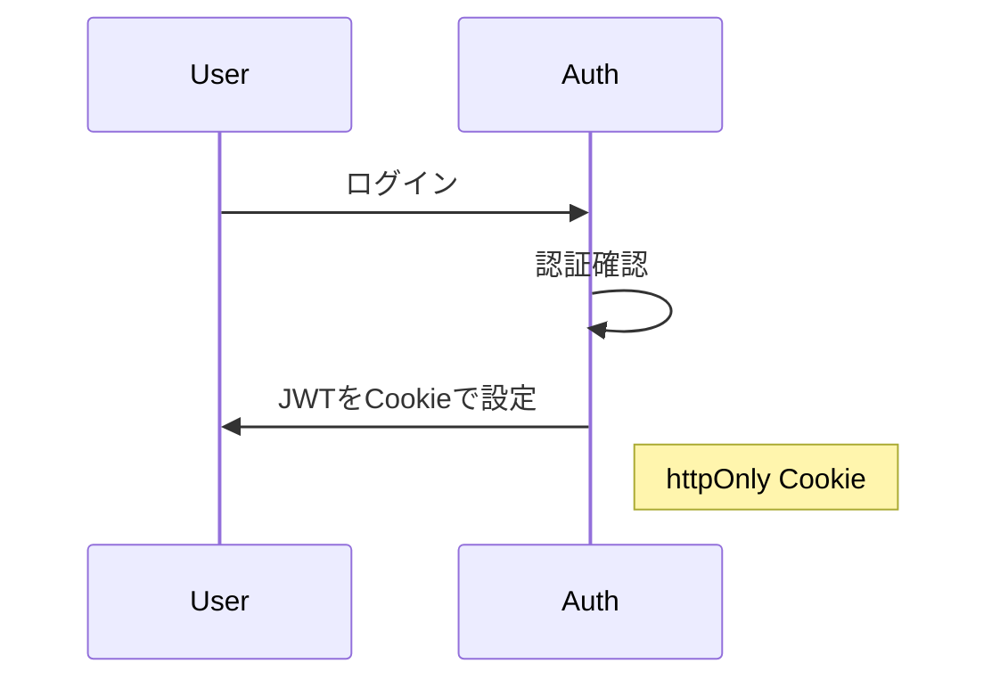
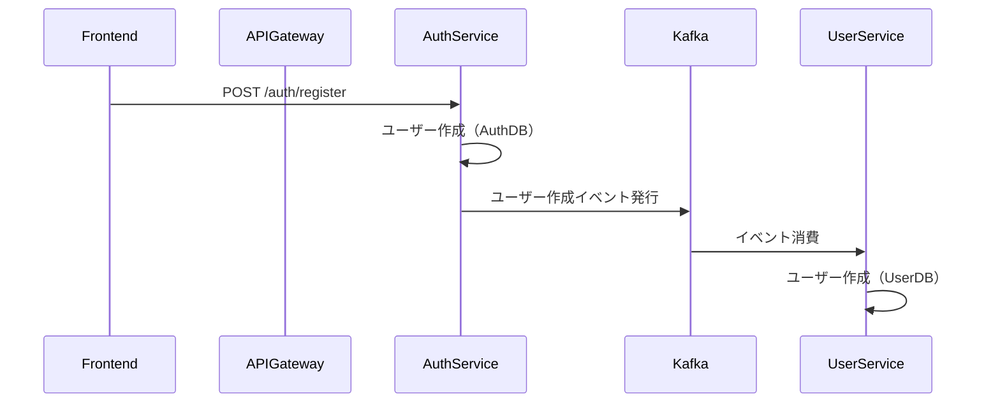
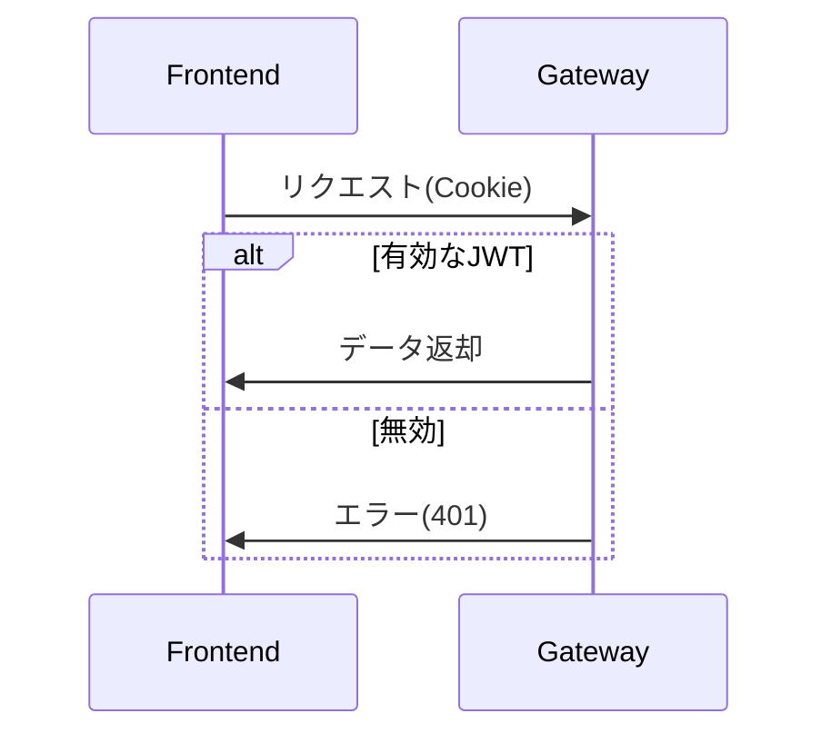

# 概要

認証機能を提供するマイクロサービスで、以下の機能を担当：

- ユーザー認証（通常・ソーシャルログイン）
- JWTトークンの発行・管理
- 認証情報のセキュアな保存
- 他サービスへのユーザー作成イベント通知

### 認証フロー



### ユーザ作成フロー



### JWT検証フロー



## ソーシャルログイン

[Google設定](https://console.cloud.google.com/apis/credentials?referrer=search&inv=1&invt=Ab0apA&project=sample-462705)

## デバッグ

### 前提:

- auth-service/compose.yaml にデバッグ用のポート設定（9229:9229）とコマンド（--inspect）が追加済みであること。
- auth-service/.vscode/launch.json に「Attach to Auth Service (Docker)」設定が記述済みであること。

### 手順

1. サービスの起動＆VSCode起動

```bash
$ cd [auth-service project]
$ docker compose up -d --build
$ code .
```

2. デバッグの開始:

- VS Codeのデバッグ開始
- Postmanなどのツールでhttp://localhost:3001 へリクエストを送信
- ※VSCode拡張機能 REST Clientを使用する場合、テストファイルauth-service/test/api/test-auth.http

### JWTのテスト

1. PostmanなどからHTTPリクエスト送信、レスポンスからJWTをコピー
2. [このサイトで検証](https://jwt.io/)

```
{
  "id": 1,
  "username": "test",
  "iat": 1750221443, ## 発行時刻
  "exp": 1750225043 ## 有効期限
}
```

3. Unix時間を日付に変換

```bash
# 発行時刻
$ date -d @1750221443
Wed Jun 18 13:37:23 JST 2025
# 有効期限
$ date -d @1750225043
Wed Jun 18 14:37:23 JST 2025
# 誤差 1h => OK!
```

### ソーシャルログインの検証

1. ブラウザで[ログイン開始URL](http://localhost:3001/social/google)にアクセス
2. リダイレクトを確認。Googleでログインと許可する
3. [ここで](https://console.cloud.google.com/apis/credentials?referrer=search&inv=1&invt=Ab0apA&project=sample-462705) 設定した[callbackURL](http://localhost:3001/auth/google/callback) にリダイレクトすることを確認</br>
   ※callbackURLをAPI Gateway経由で設定している場合はapi-serviceを起動する必要あり

# DBマイグレーション

```
$ docker compose exec auth-service npx prisma migrate dev
$ docker compose exec auth-service npx prisma generate
```
