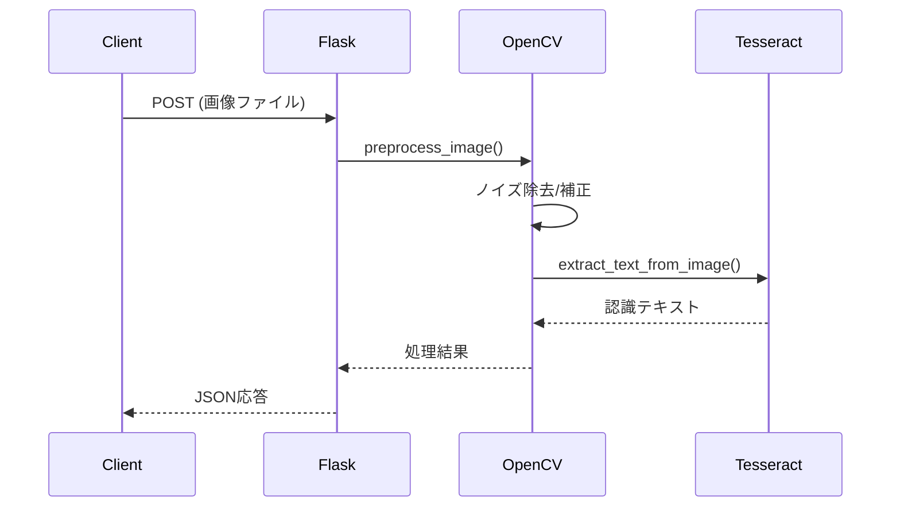

# 概要
POSTエンドポイントを通して画像をアップロードし、Pillowで読み込み、PyTesseractを使用して画像からテキストを抽出するFlaskアプリケーション。
抽出したテキストは、リクエストに対するレスポンスとして返す。

### 主な機能
- 画像ファイル(PNG/JPG/JPEG)のアップロード受付
- Pillowによる画像処理
- PyTesseractを使用したOCRテキスト抽出
- 抽出結果のJSON形式での返却

### コア技術
- **Python 3.12** - メインプログラミング言語
- **Flask** - Webアプリケーションフレームワーク
- **Pillow (PIL Fork)** - 画像処理ライブラリ
- **PyTesseract** - Tesseract OCRのPythonラッパー
- **Tesseract OCR** - オープンソースOCRエンジン





### 開発環境（Dev Containersを使用）
1. VS Codeで「Dev Containers」拡張機能をインストールする。

2. VS Codeのコマンドパレット（Ctrl + Shift + P または Cmd + Shift + P）を開く。

3. 「コンテナ」と入力する。サジェスト欄の「開発コンテナ:コンテナでフォルダを開く」を選択。

4. ファイル選択ダイアログで、現在開いているサービスディレクトリ（services/ocr-translate-service）を選択。

### Tesseractの言語データ
```bash
$ tesseract --list-langs
List of available languages in "/usr/share/tesseract-ocr/5/tessdata/" (3):
eng
jpn
```