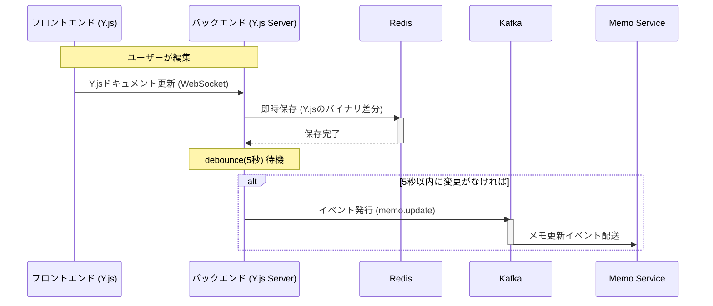

### 処理フロー

```mermaid
sequenceDiagram
    participant Frontend as フロントエンド (Y.js)
    participant Backend as バックエンド (Y.js Server)
    participant Redis as Redis
    participant Kafka as Kafka
    participant MemoService as Memo Service

    Note over Frontend,Backend: ユーザーが編集
    Frontend->>Backend: Y.jsドキュメント更新 (WebSocket)

    Backend->>Redis: 即時保存 (Y.jsのバイナリ差分)
    activate Redis
    Redis-->>Backend: 保存完了
    deactivate Redis

    Note over Backend: debounce(5秒) 待機
    alt 5秒以内に変更がなければ
        Backend->>Kafka: イベント発行 (memo.update)
        activate Kafka
        Kafka->>MemoService: メモ更新イベント配送
        deactivate Kafka
    end
```

### TODO

Redisキャッシュが消えた場合、既存データが空白で上書きされる。
永続化サービスからRedisキャッシュ更新のプッシュ通知する機能を実装する。
