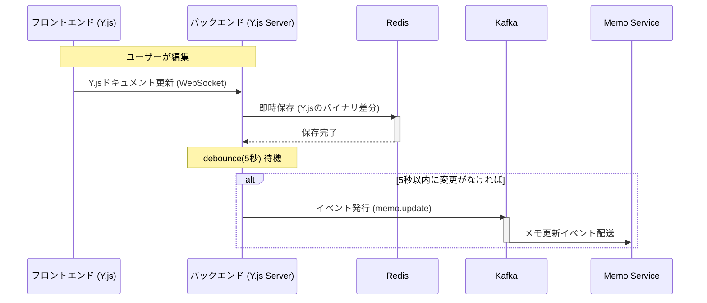

# 概要

このサービスは、複数のユーザーが同じメモをリアルタイムで共同編集できるようにするための、特別なWebSocketサーバーです。Googleドキュメントのように、複数人で共同編集できるようにYjsを活用しています。Memo Serviceと連携して、編集内容をリアルタイムで保存する役割も担っています。

### 主な機能

- WebSocketサーバー: Yjs専用に特化しているため、必要最小限の機能で高速に動作します。
- データ連携: 編集データはリアルタイムでKafkaに送信され、Memo Serviceがそのデータを受け取ってデータベースに保存します。
- キャッシュ管理: Redisを利用して、一時的なデータキャッシュを管理し、システムのパフォーマンスを向上させます。

### コア技術

- **Node.js** - JavaScript実行環境
- **y-websocket** - YjsのデータをWebSocket経由で同期するためのライブラリ
- **Kafka** - メッセージを高速に処理できる分散型のメッセージングシステム
- **Redis** - インメモリのデータ構造ストア

### 処理フロー

### TODO

Redisキャッシュが消えた場合、既存データが空白で上書きされる。
永続化サービスからRedisキャッシュ更新のプッシュ通知する機能を実装する。
