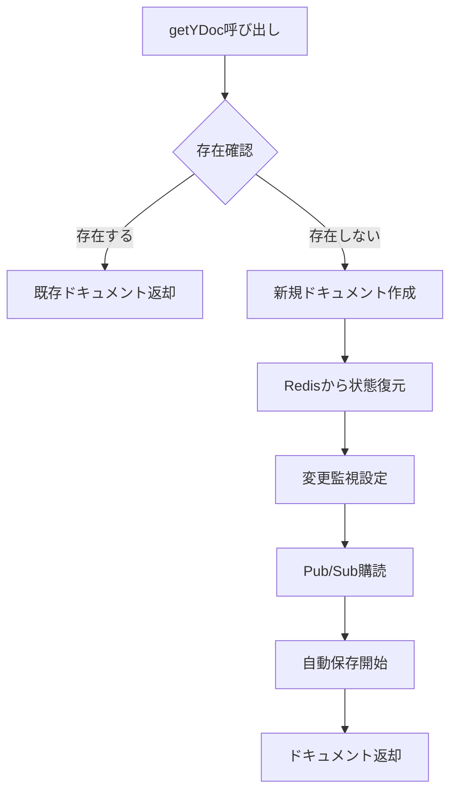
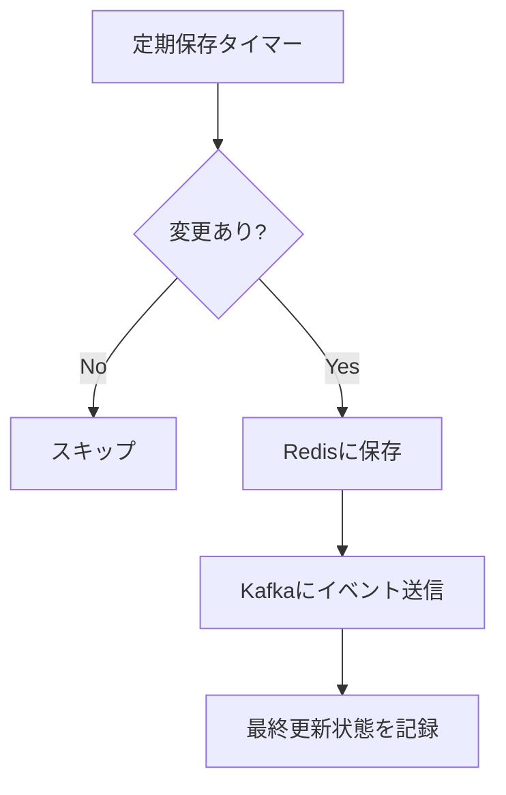

## 実行フロー

### ドキュメント取得

```mermaid
graph TD
  A[getYDoc呼び出し] --> B{存在確認}
  B -->|存在する| C[既存ドキュメント返却]
  B -->|存在しない| D[新規ドキュメント作成]
  D --> E[Redisから状態復元]
  E --> F[変更監視設定]
  F --> G[Pub/Sub購読]
  G --> H[自動保存開始]
  H --> I[ドキュメント返却]
```

### 自動保存プロセス

```mermaid
graph TD
  A[定期保存タイマー] --> B{変更あり?}
  B -->|No| C[スキップ]
  B -->|Yes| D[Redisに保存]
  D --> E[Kafkaにイベント送信]
  E --> F[最終更新状態を記録]
```
